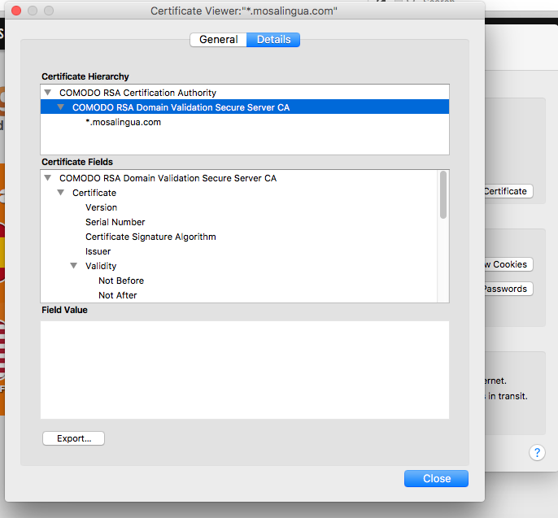
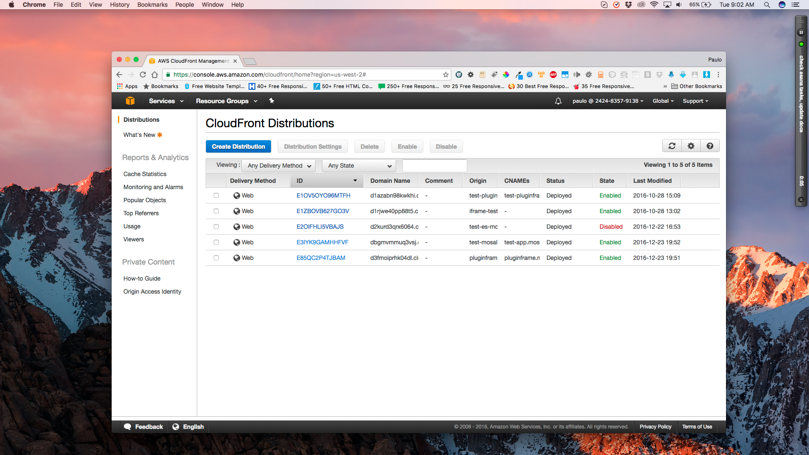
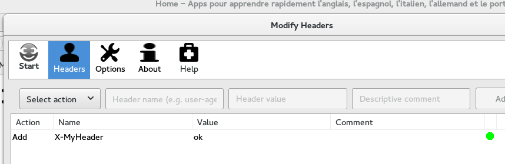

# General introductions of the Membership website

Note: this is for academy membership website, [there is another doc for mosalingua.com blogs](#MosaWeb)

We have for now 3 products (but more will come):

###  - MosaWeb 

See this video introduction:
<video src="https://dl.dropboxusercontent.com/u/396342/tmp/videos_tmp_pub/MosaWeb%20Front%20Explanation.mp4" autobuffer controls></video>

Our mobile apps working on the web + chrome plugin + lot of ressources to practice

    - subscription: 59$/year

 	- REST API call to warn our app server when user subscribe or cancel the subscription (so we give them access to our paid content inside their mobile app too)

	- conditional access: use **if user:hasAccess** shortcode to hide stuff, ex. in Welcome Popup, or Main home page template PHP)

	- auto-subscription in Mailchimp for an autoresponder: 

	- page requiring subscription, set manually with PMP

###  - MosaSpeak MasterClass (or MosaPronunciation English): 

Coaching/training to speak English with a better accent. 

See this short introduction screencast:

<video src="https://dl.dropboxusercontent.com/u/396342/tmp/videos_tmp_pub/MosaSpeak%20Front%20End%20Introduction.mp4" autobuffer controls></video>

The sales page:

[https://academy.mosalingua.com/mosaspeak](https://academy.mosalingua.com/mosaspeak)

 	- with 2 possible option:
See PMP packages : [https://academy.mosalingua.com/wp-admin/edit.php?post_type=mosa_pcg](https://academy.mosalingua.com/wp-admin/edit.php?post_type=mosa_pcg)
		- PLUS : normal version

		- COACHING : with the coaching from our English teacher (package:deluxe))

	- content dripping synchronized with an autoresponder in MailChimp

	- possibility to buy MosaTraining with a special reduction when user already bought MosaWeb (special sales page only available for people with MosaWeb)

Short screencast about the WP backend:

<video src="https://dl.dropboxusercontent.com/u/396342/tmp/videos_tmp_pub/MosaSpeak%20Explanation%20Backend.mp4" autobuffer controls></video>

###  - MosaTraining: 

Same kind as MosaSpeak, but for all language. Coaching/training to be a better language learner (to learn any language)

 	- with 2 possible option:

		- [https://academy.mosalingua.com/mosaformation/#choix-formule](https://app.mosalingua.com/mosaformation/#choix-formule)

		- premium (normal, package:premium)

		- deluxe : display 2 more posts (package:deluxe))

	- content dripping synchronized with an autoresponder in MailChimp

	- possibility to buy MosaTraining with a special reduction when user already bought MosaWeb (special sales page only available for people with MosaWeb)

	

# Development

## Running locally and Local development environment

We will be using Docker for local development. 

**Docker:**

Please download Docker Community Edition
[https://www.docker.com/](https://www.docker.com/)

Instance: 
[https://hub.docker.com/_/wordpress/](https://hub.docker.com/_/wordpress/)

/* Prepare neccesary instructions */ 

I’m using PHPStorm and NetBeans, you can choose any PHP IDE.

## 
Dev and Prod

**Dev website:**

[https://devacademy.mosalingua.com](https://devacademy.mosalingua.com)

Try there any new plugin or code, before deploying it to production:

[https://academy.mosalingua.com](https://academy.mosalingua.com)

## Repository and Pushing to the server

[https://github.com/mosalingua/MosaWeb](https://github.com/mosalingua/MosaWeb)

Warning: the repository can be out of date sometimes, because wordpress can auto-updates, etc. Please keep it up to date

We use the option in Gandi to upload to the server when we push a commit. 

gandi branch

filter-branch is used to filter out only academy.*/htdocs folder

**Gandi development repository**:

git+ssh://105056@git.dc0.gpaas.net/devacademy.mosalingua.com.git

gandi branch

Deploy:

ssh 105056@git.dc0.gpaas.net 'deploy devacademy.mosalingua.com.git gandi'

**Uploads folder:**

In order to minimize repository weight wp-content/uploads folder were excluded. All media files (eg. images, attachments) are saved in academy.*/wp-content/uploads.

I'm using **Uploads By Proxy **plugin** **in development env. ([https://wordpress.org/plugins/uploads-by-proxy/](https://wordpress.org/plugins/uploads-by-proxy/)). It allows to load images on demand from academy.* web-site.

**Gandi production repository**:

git+ssh://105056@git.dc0.gpaas.net/academy.mosalingua.com.git

gandi branch

Deploy:

ssh 105056@git.dc0.gpaas.net 'deploy academy.mosalingua.com.git gandi'

## MosaLingua Custom Plugins

* mosalingua-billing

* mosalingua-packages

* mosalingua-patches-and-fixes

* mosalingua-profile-widget

* mosalingua-short-codes

* Mosalingua-stats

* pmpro-customizations -> mosalingua-pmpro-customizations

* pmpro-series -> mosalingua-pmpro-seris

* pmpro-vat-tax -> mosalingua-pmpro-vat-tax

* pmpro-recurring-orders -> mosalingua-pmpro-recurring-orders

* pmpro-global-discount-codes-master

* pmpro-addon-packages

## Patches:

wp-content/patches

How to create: **git diff**
and apply patch: **git apply**

## Theme
.npm -> bower, sassy, gulp

Go to mosa-app-child/.npm and run **bower install

**

## Wordpress

### Updating plugins

#### DW Questions & Answer

We customized the translation, so each time you update the plugin, you should update the translations (copy from MosaChrome/wordpress-plugins/plugins-translations to the server)

### Themes

We have a master theme based on Bootstrap: inkness (not created by us).

Then we have a child theme: mosa-app-child.

They are both committed to the MosaWeb repository.

Ideally, we only want to make changes to the child theme. But unfortunately some things, we also needed to modify directly on the inkness theme

#### Inkness

The original inkness code is committed in the inkness directory on the MosaWeb repository.

All the modifications that we did to it, are saved as patches.

They are applied with the ./customize_inkness.sh script.

When we want to update this theme, we need to do:

* Copy the new inkness version to the inkness directory + commit

* Execute ./customize_inkness.sh

* Execute ./upload_inkness.sh

* Don’t commit the changes made to the inkness/ directory made by the script

#### Mosa-app-child

Try to do all modifications to the theme to this file. This is not possible for files that are also in the parent theme (like header.php, for example).

## HTTPS SSL Certificate renewal

### Renew on Namecheap

* Pay on Namecheap

* Then click on the Activate button: 

* Generate a new certificate on the Mac: [https://www.namecheap.com/support/knowledgebase/article.aspx/9683/0/macosx](https://www.namecheap.com/support/knowledgebase/article.aspx/9683/0/macosx)
The only value that is really used, I think is 'common name', which should be **.**[mosalingua.co*m](https://mosalingua.com/)
Other things such as country, I put France I think and city 'Lyon'.

* DCV method : email (with a click on the url in the email received to validate it)

* Fill contact details (I filled only the mandatory fields

On Gandi for academy.mosalingua.com and mosalingua.com

* On Gandi console

    * delete the certificate with the cross icon: 

    * **Upload it again with the padlock icon.**
See https://wiki.gandi.net/en/simple/ssl

**	Private key file on DropBox:** SSL private key certificate mosalingua.com.key

	CRT file: available on DropBox or possible to download it again [on Namecheap](https://ap.www.namecheap.com/domains/ssl/detail/2271839/mosalingua.com/dashboard)
(no new line at the end, but with the comment -----BEGIN ….)

* Then restart the server (otherwise the url doesn’t work) and wait a few minutes (so the error 503 disapear)

### For MosaDiscovery (pluginframe.mosalingua.com)

This applies to all the domains served with AWS Cloufront.

First we need to get the certificate file, the certificate chain file and the private key. The certificate file and private key are pretty much straightforward (we must have already a valid certificate). There are several ways of getting the certificate chain. One way is to open/view the certificate details on Firefox browser. From the Certificate Hierarchy we can export the different certificates on the hierarchy.. The file for the certificate chain will be the parent certificate of **mosalingua.com** certificate

Once we have all the 3 files we need to upload the certificate to CloudFront. The details are explained here: [https://docs.aws.amazon.com/IAM/latest/UserGuide/id_credentials_server-certs.html](https://docs.aws.amazon.com/IAM/latest/UserGuide/id_credentials_server-certs.html)

Example:

aws iam upload-server-certificate --server-certificate-name certificateAlias --certificate-body file://certificate.pem --certificate-chain file://certificate_chain.pem  --private-key file://private_key.key --path /cloudfront/somepath/

Once the certificate is uploaded we need to edit the corresponding distribution settings (image bellow), and choose the new uploaded certificate on the corresponding field. The  distribution will restart with the new settings 

## Redirection HTTP -> HTTPS

We installed the redirection plugin, but had to modify the .htaccess file by hand, because the default settings where causing a redirection loop.

(The reason is that probably Gandi has a load balancer in front of Apache).

These are the redirection settings for .htaccess:

*# BEGIN HTTPS Redirection Plugin*

*<IfModule mod_rewrite.c>*

*RewriteEngine On*

*RewriteCond %{HTTPS} !=on*

*RewriteCond %{HTTP:X-Forwarded-Proto} !https*

*#RewriteCond %{HTTP:X-MyHeader} ^(ok)$*

*RewriteRule ^(.*)$ https://%{HTTP_HOST}%{REQUEST_URI} [L,R=301]*

*</IfModule>*

*# END HTTPS Redirection Plugin*

(The line in green was added to fix the infinite redirection)

**SideNote**: to safely test modifications to the .htaccess file, it’s always best to temporarily add an extra rule: *RewriteCond %{HTTP:X-MyHeader} ^(ok)$*

This means that the rule will only apply to requests containing X-MyHeader = ok

Then, you can install a browser plugin ‘Modify Headers’ to add that header to requests coming from your browser:

### Indications for migration

There are 2 things to for this:

* Adding the certificate to Gandi.net. This has already been done for app.mosalingua.com. Click on the locker icon for the domain, and add the contents of the .crt and .key file (those files can be downloaded from NameCheap)

--> After this, you should be able to surf to the https version

* Then you need to redirect everything to https. I attached the .htaccess file from app.mosalingua.com to see how it's done. The important part:

RewriteEngine On

RewriteCond %{HTTPS} !=on

RewriteCond %{HTTP:X-Forwarded-Proto} !https

#RewriteCond %{HTTP:X-MyHeader} ^(ok)$

RewriteRule ^(.*)$ https://%{HTTP_HOST}%{REQUEST_URI} [L,R=301]

To test this in production with minimizing the risk of making the site unusable while working on it, you can uncomment the line:

#RewriteCond %{HTTP:X-MyHeader} ^(ok)$

Then you can use the 'modify headers' plugin on firefox (see screenshot). This will cause your browser to send a header 'X-MyHeader' with each request. So the Apache is only executed for requests coming from your computer. --> this way you can test if everything works fine first.

# OUTDATED Adding a new language (new Multisite)

THIS IS OUTDATED for the new academy.mosalingua.com website (we don’t use multisite for translations)

With the current setup (Multisite + Optimize Press + Optimize Member), you have to do the following:

* **Duplicate the website** that you wish to base the translation on with the MultilingualPress’s duplicate site feature:
See: [https://slides.tfrommen.de/multilingualpress/#/8/2](https://slides.tfrommen.de/multilingualpress/#/8/2)

* This plugin copy only the basic wordpress table. You need to also **copy the OptimizePress tables** with this kind of queries :
*CREATE TABLE wp_7_optimizepress_presets LIKE wp_optimizepress_presets;
INSERT INTO wp_7_optimizepress_presets SELECT * FROM wp_optimizepress_presets;*

*Etc. see**[ thi*s](#heading=h.w1x0pxmiguql)

* **Need to change the OP Key:**

    * Get a new key here [https://members.optimizepress.com/](https://members.optimizepress.com/)

    * Then [Update it here](https://app.mosalingua.com/en/wp-admin/admin.php?page=optimizepress-dashboard)

* **Pb with OP Editor too small to display anything: **
> it’s when you select a blank page, you need to use a template. If you don’t have, refer to the step of copying the OP tables

* **Remove link to ****[thank-you pag**e](https://app.mosalingua.com//wp-admin/post.php?post=646&action=edit) to prevent automatic redirection to the language if user bought a product on one language, the subscription must be done on that language: TODO (search the link on DB?)

### Optimize press table to copy

**All of them in MySQL:**

**Get ID of the new website with the url of the WP link: **

> here = 9

And then replace the number 9 with the ID of the new website on the following queries:

**Here are the queries to adapt queries:**

CREATE TABLE wp_9_optimizepress_assets LIKE wp_optimizepress_assets;

INSERT INTO wp_9_optimizepress_assets SELECT * FROM wp_optimizepress_assets;

CREATE TABLE wp_9_optimizepress_launchfunnels LIKE wp_optimizepress_launchfunnels;

INSERT INTO wp_9_optimizepress_launchfunnels SELECT * FROM wp_optimizepress_launchfunnels;

CREATE TABLE wp_9_optimizepress_launchfunnels_pages LIKE wp_optimizepress_launchfunnels_pages;

INSERT INTO wp_9_optimizepress_launchfunnels_pages SELECT * FROM wp_optimizepress_launchfunnels_pages;

CREATE TABLE wp_9_optimizepress_layout_categories LIKE wp_optimizepress_layout_categories;

INSERT INTO wp_9_optimizepress_layout_categories SELECT * FROM wp_optimizepress_layout_categories;

CREATE TABLE wp_9_optimizepress_pb_products LIKE wp_optimizepress_pb_products;

INSERT INTO wp_9_optimizepress_pb_products SELECT * FROM wp_optimizepress_pb_products;

CREATE TABLE wp_9_optimizepress_post_layouts LIKE wp_optimizepress_post_layouts;

INSERT INTO wp_9_optimizepress_post_layouts SELECT * FROM wp_optimizepress_post_layouts;

CREATE TABLE wp_9_optimizepress_predefined_layouts LIKE wp_optimizepress_predefined_layouts;

INSERT INTO wp_9_optimizepress_predefined_layouts SELECT * FROM wp_optimizepress_predefined_layouts;

CREATE TABLE wp_9_optimizepress_presets LIKE wp_optimizepress_presets;

INSERT INTO wp_9_optimizepress_presets SELECT * FROM wp_optimizepress_presets;

### Common problems

#### Reset password not working (occurs on the main French site)

There is the plugin "Multisite: Passwort Reset on Local Blog“ to avoid that:

Make sure it’s activated.

## Membership plugins

### Matrix comparisons of our possible solutions

[https://docs.google.com/spreadsheets/d/1_7xWwZugmmCWa7a-US0wuAamZZkrsWxHOmLqXscdPpc/edit#gid=0](https://docs.google.com/spreadsheets/d/1_7xWwZugmmCWa7a-US0wuAamZZkrsWxHOmLqXscdPpc/edit#gid=0)

### WooCommerce Membership + subscription

* + can integrate easily with Sensei LMS

* + good for the future (if we want to sell more product)

* - not easy to translate (OK with Multisite?)

* - expensive 129 (sensei) + 200 (subscription) + 149 (membership) = 478$ (but then half price each year to get updates)

* Heavy solution

### Memberpress

Good rate from[ Chris Lema](https://chrislema.com/best-wordpress-membership-plugin-2015/):

[https://www.memberpress.com/](https://www.memberpress.com/)

Can combine with :

[https://flyplugins.com/wp-courseware/](https://flyplugins.com/wp-courseware/)

##### Paid Membership Pro:

**Multiple Concurrent Accounts: rated 1/5**

*Can a single registered account holder exist in more than one membership level or group at the same time? This is often a critical need when someone is using a membership plugin to deliver protection over course-related content. Just because you’re in one membership program (writing your first book) doesn’t mean you may not want access to another (learning how to shoot videos for YouTube).*

* **_Asked PMP support: not possible_**

##### **S2Member** (same base as OPtimize Member)

Question asked:  We need some "REST API notification" / "Hooks" to send the info to another server when user register or cancel his subscription like that :

Is it easily possible with aMember?

*Hello,*

*I am currently using Optimize Press with Optimize Member. But I find it very limited.*

*We want to sell several independent products (one of them with monthly subscription), but we have to create a new website for each product because if a client ask a refund for 1 product (with Clickbank), he will be demoted to Level 0 and loose access to all of his roles/capabilities/packages. We want to have only 1 website with the possibility to buy or subscribe independently to several info products.*

*Also, all the products content must be inside wordpress pages.*

*Is ***_XXXXXX_*** right for me?*

*Thanks in advance for your answer,*

*Best regards,*

*Samuel*

##### AMember:

*asked support question**[ https://mail.google.com/mail/?view=cm&fs=1&tf=1&to=support@cgi-central.ne*t](https://mail.google.com/mail/?view=cm&fs=1&tf=1&to=support@cgi-central.net)

*amember.com*

**_I don't see how is it possible to define access rights for each wordpress pages like I use to do with Optimize Member:_**

**_

**_Also, is it possible to drip wordpress content (delay the display of some content) ?_**

**_Answer_**

*aMember has flexible system of products/access permissions*

*(we do not use term "levels" although it can be implemented*

*too if necessary) and if some subscription is over or refunded*

*it does not affect other subscriptions.*

*aMember itself is not a WP plugin, it is a separate application*

*that will be installed to your website. However, we have developed*

*WP plugin that connects WP and aMember. It is not available in*

*the online demo, but it allows to setup access permission to*

*WP pages, drip content, use special shorttags and lot lot more.*

*We will install aMember and WP integration for you, and make*

*initial configuration according to your requirements. It is free*

*and included into price.*

**_We need some "REST API notification" / "Hooks" to send the info to another server when user register or cancel his subscription like that :_**

**_

**_

**_Is it easily possible with aMember?_**

*This is easy if you know php. aMember has several events that will be executed on user's signup/expiration and you can insert your php code to handle these events.*

*Please have a look:*

*[https://www.amember.com/docs/Site.php_fil*e](https://www.amember.com/docs/Site.php_file)

*[https://www.amember.com/docs/API/HookManage*r](https://www.amember.com/docs/API/HookManager)

*We also can implement this for you for small additional fee.*

*-> They will create a plugin soon*

## Translation Plugin

### Javascript translation

* + Elegant solution

* +Easy for translators (really visual)

* - Not able to translate emails (or will need complex hacks). Or we send all the email in different language? (first English, then translations below?)

* Might be complicated to customize things (ex. Get the current language for the MosaApp integration? Maybe not with [the API](https://www.bablic.com/documentation/js-events))

* Dependant of them, they can stop or increase the price

* - monthly subscriptions

* **Not working well (after extensive testing)**

Cheapest one: [https://www.bablic.com/](https://www.bablic.com/) (about 50$/month)

### WPML

* +looks great on paper

* Too much problems with compatibility and plugins (but workable)

### MultilingualPress

* + Less pb of compability

* + Free

* - lot of wordpress maintenance work 

* - not easy for translators

## Research about Membership plugins and LMS

## **Technical choices**

Normal theme + plugins

------------------------------------

plugins:

For points system :[ https://mycred.me/](https://mycred.me/)

**Badges** :[ https://badgeos.org/](https://badgeos.org/)

Course, progress, quizz:[ https://study-press.com](https://study-press.com/) (but too recent?)

theme: (need to find a good looking theme and easy to customize)

[https://github.com/Jonnyauk/Wonderflux](https://github.com/Jonnyauk/Wonderflux)

Which is a 'parent' theme that allows overriding where necessary

[https://roots.io/](https://roots.io/)

[https://underscores.me/](https://underscores.me/)

Community themes

------------------------------

[https://themeforest.net/item/klein-a-nittygritty-community-theme/5418518?ref=cirvitis](https://themeforest.net/item/klein-a-nittygritty-community-theme/5418518?ref=cirvitis)

-> looks great to create a community. But include also paid membership.

Full LMS theme

-----------------------

Maybe those theme are trying to handle too much (payments, course creations, authors, etc.)

[https://themeforest.net/item/wplms-learning-management-system/6780226?ref=cirvitis](https://themeforest.net/item/wplms-learning-management-system/6780226)

WPLMS is a Learning Management System for WordPress. It is an e-learning WordPress theme for course management, instructor and student management using which you can create and sell your courses online. 

The theme turns your WordPress setup into an LMS, utilising the potential of WordPress + BuddyPress + BBPress + WooCommerce. WPLMS is compatible with TinCan/XAPI specifications and a lot of popular plugins such as WP Coauthors plus, MyCred points system, BadgeOS, PMPro, DwQ&A and more.. The Theme package includes 8 custom plugins built specifically for the theme to provide the complete learning experience.

[https://themeforest.net/item/clever-course-learning-management-system-theme/8645312](https://themeforest.net/item/clever-course-learning-management-system-theme/8645312)

[https://themeforest.net/item/academy-learning-management-theme/4169073?ref=cirvitis](https://themeforest.net/item/academy-learning-management-theme/4169073?ref=cirvitis)

SENSEI

[https://www.woothemes.com/products/sensei/](https://www.woothemes.com/products/sensei/)

(200$ + buy a theme. ex:[ https://themeforest.net/item/guru-learning-management-wordpress-theme/7807232?ref=cirvitis](https://themeforest.net/item/guru-learning-management-wordpress-theme/7807232?ref=cirvitis)) Not compatible with WPML??

Teaching coursework has never been easier, all within WordPress. With the Sensei plugin you can create courses, write lessons, and add quizzes. Set lesson and course pre-requisites, allow user registration and even charge for your course content if you want. Sensei is the ultimate WordPress learning management system!

WP COURSEWARE

[https://flyplugins.com/wp-courseware/](https://flyplugins.com/wp-courseware/)

not fully WPML compatible, and not compatible with OPtimze

**Learn Dash** 

looks good too: [https://www.learndash.com/wordpress-course-plugin-features/](https://www.learndash.com/wordpress-course-plugin-features/)

Lot of feature, but design and UX not very good.. (ex. their demo course)

