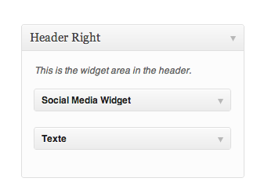

# General information

Our website is in 6 languages, and we use the multisite feature of wordpress to handle each languages: each language is a separate blog

### sFTP access

**Server sFTP**: sftp.dc0.gpaas.net

**User**: 105056

**Password** : (please ask it by Skype)

## Wordpress Admin

We have an additional password protection (htpasswd) for the wp-login.php:

User: mosalingua

Password: O0D-2pT}syaE{=OJ

### Database backup

We have a cron job running everyday dumping the mysql db in **/lamp0/tmp/mysql_backup** :

The cron job (anacron file) is here: **/lamp0/etc/cron**

## In case of problem of our website (gandi hosting, etc.)

Our domains are managed by namecheap but the websites are hosted on Gandi:

Login: SM3878-GANDI (ask for the password by Skype)

**In case of hosting problem (ex. Error 503, etc.):**

* Login

* Click on Simple Hosting:  Then click on mosalingua

* **Check the Statistics: **
 - if Low disk space, delete unsused files with sFTP (maybe old backups in /lamp0/tmp/mysql_backup)
 - if CPU is always 100%, there might be a buggy plugin or a new installed WP software causing problem. Try to disable it. If no access to WP admin, you can try with FTP (ex. mosalingua.com/wp-content/plugins and backup then delete the directory of the buggy plugin)
** - if it’s something else:**

* Contact Gandi support by Chat to have a quick answer:
Click on the help icon: 
Then click on the chat icon: https://www.dropbox.com/s/in6mutziw5nqx4y/Screenshot%202016-11-09%2017.24.59.png?dl=0

* If you don’t know what else to do, create a job post on upwork (ex. Of title "Urgent, fix XXX pb on a website"), but only hire someone very trustful (with a lot of very good rating, etc.)

# Problem with gandi hosting

login: SM3878-GANDI

Pw: (cf Skype)

Video to contact the support:

[https://dl.dropboxusercontent.com/u/396342/tmp/videos_tmp_pub/Problem%20with%20Gandi%20-%20how%20to%20deal%20with%20the%20support.mp4](https://dl.dropboxusercontent.com/u/396342/tmp/videos_tmp_pub/Problem%20with%20Gandi%20-%20how%20to%20deal%20with%20the%20support.mp4)

## Problem with Namecheap (DNS, domain name)

https://www.namecheap.com/

Login: sampub

Pw: (cf skype)

## Performances optimization, W3TotalCache, CDN

The website should load in less than 4 seconds:

We have W3TC plugin installed. 

We pay for MaxCDN. Activating the CDN settings of W3TC plugin makes the site loads in 20s or more. That’s why we installed the simple plugin CDNRewrite

# MosaLingua Theme (Child Theme of a Genesis Theme)

## 1. Updating Main Navigation 

1. GoTo your wp-dashboard  >  Appearance  >  Menus

2. Website’s main menu is assigned to ‘Secondary Navigation Menu’

3. Select ‘Main Menu’ and add/remove pages or links.

More details in this video : [https://www.youtube.com/watch?v=WIiXje-MtmE](https://www.youtube.com/watch?v=WIiXje-MtmE) 

## 2. Updating Flag Switch & Social Media

1. GoTo your wp-dashboard  >  Appearance  >  Widgets

2. GoTo ‘Header Right’ Section of widgets. In there first is social media widget and second text widget contains ‘code’ for Flag Section

3. You can add more social media links with icons from its settings.

4. Similarly next ‘text widget’ has HTML code for flag switch.

## 3. Updating Homepage Banner Section

GoTo your wp-dashboard  >  Appearance  >  Widgets  >  Banner Section

* *‘1st text widget’ is for iPhone slide-show *

* *‘2nd text widget’ is for Application links *

* *‘3rd text widget’ is for video pop-up*

**_To add more slides to ‘iPhone slide-show’_**

* add new line of code between <ul></ul>

<li></li>

## 3. Testimonials Settings & Add/update

GoTo your wp-dashboard  >  Appearance  >  Widgets  >  Testimonials & Press Widget

   - you can change title

   - you can edit number of testimonials   

   to show

   - and choose group to show testimonials  

   from

**_To add new testimonial_**

1. GoTo wp-dashboard  >  Testimonials  >  Testimonials  

2. Click on ‘Add New Testimonial’ button

3. Add testimonial details and click on add button

* select group 

* check "Show in Widget"

* add client name, picture url, country and website

* in case there’s no client picture, you’ll need to add avatar pic. url

[https://www.mosalingua.com/en/files/2012/12/test_pict.jpg](https://www.mosalingua.com/en/files/2012/12/test_pict.jpg)

## 4. Updating Bottom section

GoTo your wp-dashboard  >  Appearance  >  Widgets  >  Bottom 2 Widget

* ‘1st test widget’ for about section

* ‘2nd social media widget’ for social media links

* ‘3rd text widget’ for subscriptions

## **Updating** footer section

GoTo your wp-dashboard  >  Appearance  >  Widgets  >  Footer 

## 4. Updating Single Application Page

1. GoTo your wp-dashboard  >  Pages  >  Select Page to Edit

2. Edit text with editor and or you can edit from custom fields. 

3. Some part can be modified after the body of the page, in the following fields:

* app-overview = application information

* app-title = application name

* app-thumbnail-url = application thumbnail

* app-store-link = "link to apple store page"

* app-store-link-text = "app store link botton text"

* app-android-link = "link to android market page"

* app-android-link-text = "android link button text"

* App-Call-2-Action-1 = "First call 2 action section HTML code"

* App-Call-2-Action-2 = "Second call 2 action section HTML code"

## 5. Updating Blog Landing Page Slider

GoTo your wp-dashboard  >  Settings  >  Lazy Content Slider

* Select category of blog post to show in slider

* while adding new post, choose post category and upload featured image for post, so it will appear in slider

## 6. Updating Lazy Content Slider Plugin

Once you update "Lazy Content Slider" Plugin, you’ll need to edit one file after that...

*1. open ‘lzcs.php’ file*

*2. find for line "function drawslider() {"*

*3. you’ll need to replace whole "drawslider" function with this code - *

    function drawslider() {

    global $post;

    $recent_posts = getDisplayPosts();

    if (count($recent_posts) == 0) {

        return;

    }

    echo "
";

    echo "<ul class=\"ui-tabs-nav\">";

    foreach( $recent_posts as $recent ){

        $postid = $recent["ID"];

        $thumbnail =  get_the_post_thumbnail($postid, array(50,50) );

    ?>

        <li class="ui-tabs-nav-item ui-tabs-selected" id="nav-fragment-<?php echo $recent["ID"] ?> ">

            <a href="#fragment-<?php echo $recent["ID"]; ?>"><?php echo $thumbnail ?><?php echo esc_attr($recent["post_title"]); ?></a>

        </li>

    <?php

    }

    echo '</ul>';   // Closing the div.ui-tabs-nav

    

    foreach( $recent_posts as $recent ){

        $postid = $recent["ID"];

        $postexcerpt = $recent["post_content"];

        $postexcerpt = preg_replace ( "'<[^>]+>'U", "", $postexcerpt);

        $postexcerpt = string_limit_words($postexcerpt,50);

        $largeimage = get_the_post_thumbnail( $postid, 'homepage-thumb' );

		

		$num_comments = get_comments_number(); // get_comments_number returns only a numeric value

    ?>                      

        
" class="ui-tabs-panel" >

            <h2><a href="<?php echo get_permalink($recent["ID"]) ?>" ><?php echo esc_attr($recent["post_title"]); ?></a></h2>

			<?php echo $largeimage ?>

                	

                    
<?php echo $postexcerpt; ?>...

                    <a href="<?php echo get_permalink($recent["ID"]) ?>#comments" class="cmnt"><?php echo get_comments_number($recent["ID"]); ?> Comments</a>

                    <a href="<?php echo get_permalink($recent["ID"]) ?>" class="rd_more_btn">read more</a>

                    

        

    <?php

    }

